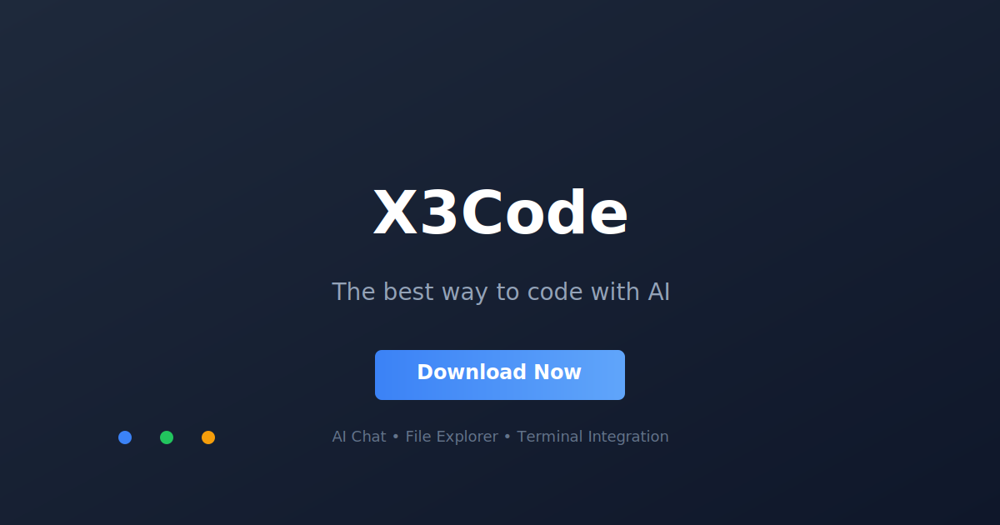

# X3Code

> The best way to code with AI

A modern desktop GUI for coding agents. Chat with AI, manage files, and see real-time output in a beautiful interface.



## Features

- **AI Chat Interface** - Chat with Codex and Claude Code agents in a beautiful, streaming interface with syntax highlighting
- **File Explorer** - Browse, create, and manage your project files with an intuitive tree view and context menus
- **Terminal Integration** - See real-time output from agent processes in a collapsible terminal panel

## Download

Download the latest version from the [releases](https://github.com/Sync-Pro/t3code-releases) page.

## Tech Stack

- **Electron** - Desktop application framework
- **React** - UI library
- **Tailwind CSS** - Styling
- **Vite** - Build tool

## Development

```bash
# Install dependencies
npm install

# Run in development mode
npm run dev

# Build for production
npm run build

# Preview production build
npm run preview
```

## License

[MIT](./LICENSE)

---

Built with ❤️ by the X3Code team
